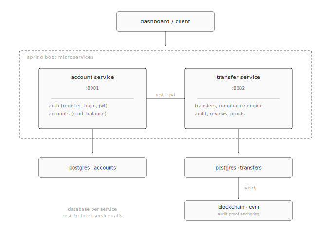
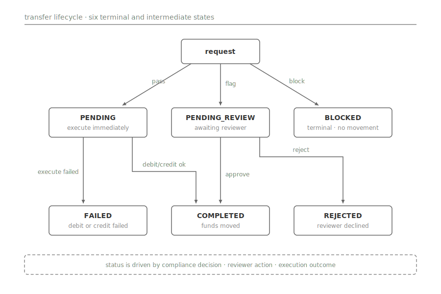
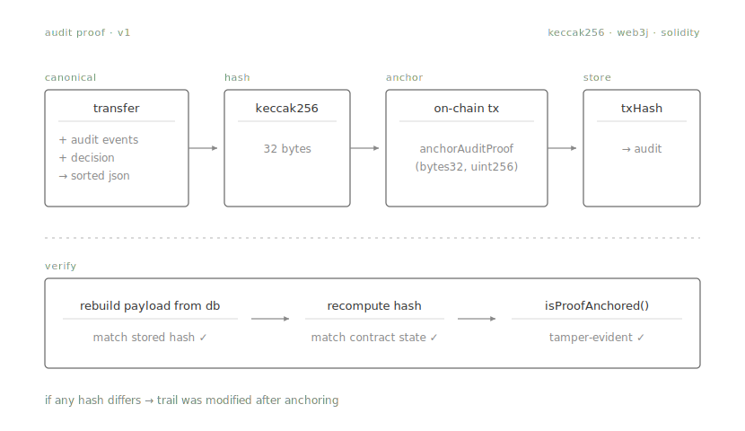

### compliflow 

## description

CompliFlow is a compliance-first payment system. The rule is simple: funds do not move until compliance makes a decision.

Every transfer goes through a rule engine that returns one of three outcomes: `PASS`, `FLAG`, or `BLOCK`. Every rule decision is saved as an audit event. When the transfer reaches a final state, the audit trail can be hashed and anchored on a blockchain so it cannot be silently modified later.

## architecture

CompliFlow has two Spring Boot services, each with its own PostgreSQL database. They talk to each other over REST with JWT. The transfer service also talks to a local blockchain over web3j to store audit proofs.

- **account-service** (`:8081`) handles registration, login, and accounts with balances.
- **transfer-service** (`:8082`) handles transfers, the compliance engine, the audit trail, manual reviews, the restricted-party list, and the blockchain proof flow.

## compliance engine

Every transfer is checked by a set of rules before any money moves. Each rule returns a decision - `PASS`, `FLAG`, or `BLOCK` - with a reason and a short explanation. The engine collects all decisions and takes the strictest one as the final answer (`PASS < FLAG < BLOCK`).

There are five rule categories:

- **threshold** - amount too high
- **watchlist** - account or wallet is on the restricted list
- **frequency** - too many recent transfers
- **risk score** - counterparty looks risky
- **wallet screening** - target wallet is restricted

Each decision also records a legal context (why this matters for regulators), an internal policy reference, and a user-facing explanation, so the same decision can be read by an auditor, a compliance officer, and a customer.

## decision table

Instead of hardcoding rules in Java, CompliFlow stores them as rows in the database. Each row describes conditions (amount range, currency, risk scores, flags, etc.) and the decision to take when those conditions match.

Every matching rule contributes one decision, and the strictest one wins. Changing policy means editing rows - no redeploy needed.

## transfer lifecycle

A transfer can end up in one of six states. Where it lands depends on the compliance decision, the execution outcome, and the reviewer’s action.

- `PASS` → `PENDING` → execute debit and credit → `COMPLETED`  
  If execution fails, the debit is reversed and the transfer becomes `FAILED`.

- `FLAG` → `PENDING_REVIEW` → wait for a human  
  On approve, it executes and completes. On reject, it becomes `REJECTED` with no money moved.

- `BLOCK` → `BLOCKED`  
  Terminal state, no money moves, and the audit trail explains why.

## manual review

Flagged transfers wait in a queue until a reviewer decides. The reviewer sees everything: the transfer details, all rule evaluations, legal and policy references, and the audit history. Their decision - approve or reject - is saved as another audit event with their identity, timestamp, and optional comment.

Only transfers in `PENDING_REVIEW` can be reviewed.

## restricted-party screening

CompliFlow checks every transfer against a restricted-party list. Three match types are supported:

- exact account number
- exact wallet address
- name pattern

Entries can be deactivated without deleting them, so history is preserved.

On every transfer, the source account, destination account, and target wallet are checked. Any match sets a flag on the transfer context, and the compliance engine turns that flag into a `BLOCK` decision.

## audit events

Every rule decision on every transfer is saved as an audit event. Each event stores:

- the rule name
- the policy code
- the decision
- the reason
- the legal context
- the internal policy
- the user-facing explanation
- a timestamp

Reviewer decisions are saved the same way.

This table is the source of truth for the review screen, the reports, and the blockchain proof.

## audit proof anchoring

Once a transfer is final, its audit trail can be turned into a cryptographic proof that anyone can verify later.

### 1. Build a canonical payload

The transfer and all its audit events are serialized into a JSON document with a fixed key order and sorted events, so the same inputs always produce the exact same bytes.

### 2. Hash it

The payload is hashed with `keccak256`, the same algorithm Ethereum uses.

### 3. Anchor it on-chain

A transaction to the `AuditAnchorRegistry` contract saves the hash on the blockchain. Only final transfers (`COMPLETED`, `BLOCKED`, `REJECTED`, `FAILED`) can be anchored, and each hash can only be anchored once.

### 4. Store the transaction hash

The on-chain transaction hash is saved back on the audit events, so the proof is linked to the data it commits to.

### verification

Rebuild the payload from the database, hash it again, and compare. If the hash still matches the one stored on-chain, the audit trail was not modified. If it does not match, something was changed after anchoring.

The payload and personal data stay off-chain. Only the 32-byte hash, the transfer ID, and the schema version go on-chain.

## tech stack

 ## license

This project is licensed under the GNU General Public License v3.0 - see the [LICENSE](LICENSE) file for details.
